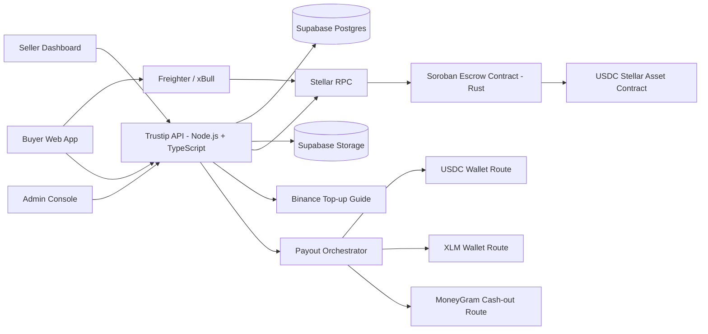
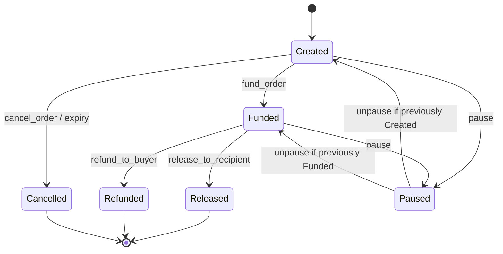
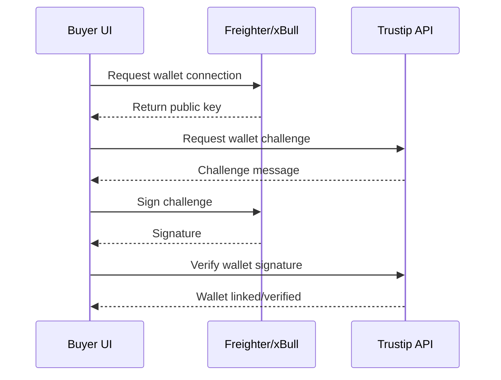
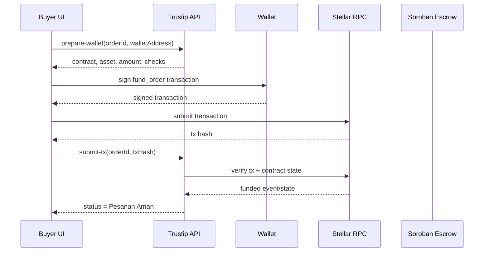
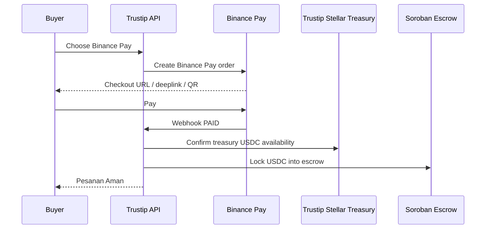

# Trustip API & Soroban Contract Spec v1.1

**Product:** Trustip - Stellar-Native Protected Checkout  
**Document type:** API & Soroban Contract Specification  
**Version:** v1.1  
**Status:** Build-ready draft  
**Latest product decision:** Buyer payment uses Stellar Wallet Native with USDC on Stellar via Freighter and xBull. Binance is used as a guided top-up path. Seller payout supports multi-route payout: USDC wallet, XLM wallet, and MoneyGram cash-out/off-ramp route. Binance Pay is a future feature.

---

## 1. Purpose

This document defines the API, wallet, blockchain, escrow, payout, and backend orchestration rules for Trustip.

It is intended for:

- frontend engineers building buyer, seller, and admin flows;
- backend engineers implementing API endpoints, database transactions, and workers;
- smart contract engineers implementing the Soroban escrow contract in Rust;
- AI coding agents that need strict boundaries for implementation.

The goal is to avoid ambiguity around wallet payment, USDC escrow, release/refund, shipment, refund evidence, Trust Profile, and multi-route seller payout.

---

## 2. Locked Scope Summary

### 2.1 Buyer Payment - MVP

Trustip MVP buyer payment uses:

- **Payment asset:** USDC on Stellar.
- **Buyer wallet:** Stellar Wallet Native, initially Freighter and xBull.
- **Wallet connection:** Stellar Wallets Kit or equivalent wallet adapter.
- **Escrow:** Soroban smart contract that locks USDC until release or refund.
- **Top-up helper:** Binance guided top-up page. Buyer obtains USDC through Binance, withdraws to a Stellar wallet, then pays with the Stellar wallet.

Trustip does **not** automatically convert Rupiah to USDC in the MVP.

### 2.2 Seller Payout - v1.1

Trustip seller payout supports a multi-route model:

1. **USDC_WALLET** - direct USDC payout to seller Stellar wallet.
2. **XLM_WALLET** - optional/stretch route to receive XLM instead of USDC.
3. **MONEYGRAM_CASHOUT** - seller off-ramp route through MoneyGram cash-out or MoneyGram-supported payout flow.

Implementation level:

- **MVP baseline:** USDC wallet payout must work end-to-end.
- **MVP/Stretch:** MoneyGram route can be represented as guided seller off-ramp or payout request route if integration access is not available.
- **Production:** Integrated MoneyGram payout requires partner/API access, compliance review, KYC/KYB, and operational reconciliation.

### 2.3 Future Payment and Payout

Future features may include:

- Binance Pay checkout;
- Trustip Stellar Treasury;
- automated rebalancing from Binance to Stellar;
- local bank / QRIS / VA payment through a licensed provider;
- Stellar anchor flow using SEP-6, SEP-24, SEP-12, and SEP-38;
- direct bank payout through a licensed off-ramp partner.

### 2.4 Explicitly Out of Buyer Payment MVP

Do not implement these as MVP buyer payment flows:

- QRIS payment;
- bank transfer payment;
- automatic Rupiah to USDC conversion inside Trustip;
- buyer-facing payment simulator;
- internal Add Balance wallet top-up;
- payment gateway integration such as Xendit or Midtrans;
- Binance Pay merchant checkout as core MVP.

MoneyGram is **not** a primary buyer checkout rail in v1.1. MoneyGram is part of the seller payout/off-ramp strategy.

---

## 3. Stellar Ecosystem Usage

### 3.1 MVP Stellar Components

| Component                         | Status | Trustip usage                                                 |
| --------------------------------- | -----: | ------------------------------------------------------------- |
| Stellar Wallet                    |    MVP | Buyer pays and seller receives funds through Stellar accounts |
| Freighter                         |    MVP | Primary browser wallet for connect and sign                   |
| xBull                             |    MVP | Alternative Stellar wallet                                    |
| Stellar Wallets Kit               |    MVP | Wallet adapter layer for Freighter and xBull                  |
| USDC on Stellar                   |    MVP | Payment and escrow asset                                      |
| Soroban Smart Contract            |    MVP | Escrow lock, release, and refund                              |
| Rust + Soroban SDK                |    MVP | Smart contract implementation                                 |
| Stellar Asset Contract / SAC      |    MVP | Contract interface for Stellar assets such as USDC            |
| SEP-41 Token Interface            |    MVP | Token interface used by SAC                                   |
| Stellar RPC                       |    MVP | Submit/read contract transactions, events, and state          |
| Transaction hash / explorer links |    MVP | Payment proof and audit trail                                 |

### 3.2 Recommended but Non-Blocking

| Component            |      Status | Usage                                         |
| -------------------- | ----------: | --------------------------------------------- |
| SEP-10               | Recommended | Wallet-based authentication / ownership proof |
| SEP-1 / stellar.toml | Recommended | Trustip domain and ecosystem identity         |

### 3.3 Future Anchor SEPs

| SEP    | Status | Why not MVP                                                    |
| ------ | -----: | -------------------------------------------------------------- |
| SEP-6  | Future | Requires anchor deposit/withdraw integration                   |
| SEP-24 | Future | Requires hosted anchor deposit/withdraw flow                   |
| SEP-12 | Future | Required when Trustip/anchor collects KYC for on/off-ramp      |
| SEP-38 | Future | Required for anchor quote/RFQ fiat-to-crypto or crypto-to-fiat |

Trustip v1.1 is USDC-first. It is not an IDR anchor app. Anchor SEPs become relevant when Trustip integrates a real IDR on-ramp or direct bank/cash payout partner.

---

## 4. System Architecture



### 4.1 Source of Truth

Trustip uses two sources of truth:

1. **Application database** stores users, sellers, orders, shipment, refund, evidence, review, Trust Profile, payout preferences, and UI statuses.
2. **Soroban contract** stores escrow-critical fund state: created, funded, released, refunded, cancelled, or paused.

The database must not mark an escrow as funded, released, or refunded unless a valid on-chain transaction or contract event confirms it.

### 4.2 Stellar RPC Rule

Stellar RPC is used for transaction submission, contract state reads, and event sync. It must not be treated as Trustip's permanent event database. Trustip must store all important payment, escrow, refund, and payout events in Supabase tables.

---

## 5. Roles and Permissions

| Role        | Description                                   | Main permissions                                                                                                                  |
| ----------- | --------------------------------------------- | --------------------------------------------------------------------------------------------------------------------------------- |
| Guest Buyer | Buyer who opens checkout link without account | View public checkout, connect wallet, pay                                                                                         |
| Buyer       | Buyer with email/session account              | Pay, track order, confirm received, request refund, upload evidence, review seller                                                |
| Seller      | Registered seller                             | Create checkout links, view orders, update shipment, respond to refund, configure payout method                                   |
| Admin       | Trustip operator                              | Review refunds, force release/refund when allowed, pause accounts/orders, update Trust Profile penalties, supervise payout routes |
| System      | Backend worker / cron                         | Sync on-chain transactions, update statuses, calculate Trust Profile metrics, sync payout status                                  |

### 5.1 Wallet Ownership

A wallet address is linked to a user only after the user signs an ownership challenge. The API must not trust a typed wallet address without wallet signature verification.

### 5.2 Payout Ownership

A seller payout method must be verified before being used as the default payout route. USDC and XLM payout addresses require wallet ownership verification. MoneyGram payout information requires seller identity and operational validation according to the selected implementation level.

---

## 6. API Conventions

### 6.1 Base Path

```http
/api/v1
```

### 6.2 Authentication

- Public checkout endpoints may be accessed without login.
- Buyer actions that change order state require either authenticated session or signed checkout token.
- Wallet ownership actions require signed wallet challenge.
- Seller/admin endpoints require authenticated role-based access.
- System sync endpoints require service role or signed internal token.

### 6.3 Response Envelope

```json
{
  "success": true,
  "data": {},
  "error": null,
  "meta": {
    "requestId": "req_..."
  }
}
```

Error response:

```json
{
  "success": false,
  "data": null,
  "error": {
    "code": "ORDER_NOT_FOUND",
    "message": "Order not found.",
    "details": {}
  },
  "meta": {
    "requestId": "req_..."
  }
}
```

### 6.4 Idempotency

Payment preparation, escrow creation, release, refund, and payout execution endpoints must support idempotency.

Recommended header:

```http
Idempotency-Key: <uuid>
```

The same idempotency key must not create duplicate orders, duplicate escrow records, duplicate releases, duplicate refunds, or duplicate payout transactions.

---

## 7. Core Status Enums

### 7.1 Order Status

| Status              | Meaning                                                        |
| ------------------- | -------------------------------------------------------------- |
| `awaiting_payment`  | Buyer has not paid yet                                         |
| `payment_submitted` | Wallet transaction submitted, waiting confirmation             |
| `payment_confirmed` | Payment confirmed on-chain                                     |
| `escrow_locked`     | USDC is locked in Soroban escrow                               |
| `processing`        | Seller is preparing the order                                  |
| `packed`            | Seller has packed order                                        |
| `shipped`           | Seller has shipped order and added tracking/proof              |
| `delivered`         | Shipment marked delivered by seller/courier/admin evidence     |
| `completed`         | Buyer confirmed received and escrow released                   |
| `payout_pending`    | Escrow released, payout route is being processed               |
| `payout_completed`  | Seller payout is completed or available through selected route |
| `refund_requested`  | Buyer requested refund/problem review                          |
| `refund_review`     | Admin/system review is in progress                             |
| `refunded`          | Escrow refunded to buyer                                       |
| `cancelled`         | Order cancelled before funds are locked                        |
| `failed`            | Order or transaction failed                                    |

### 7.2 Payment Status

| Status                    | Meaning                                            |
| ------------------------- | -------------------------------------------------- |
| `unpaid`                  | No valid payment received                          |
| `wallet_connect_required` | Buyer must connect wallet                          |
| `trustline_required`      | Buyer needs USDC trustline                         |
| `insufficient_balance`    | Buyer lacks USDC or XLM fee balance                |
| `tx_pending_signature`    | Transaction prepared, waiting for wallet signature |
| `tx_submitted`            | Transaction submitted to network                   |
| `tx_confirmed`            | Transaction confirmed on-chain                     |
| `failed`                  | Transaction failed                                 |
| `expired`                 | Payment quote/order expired                        |

### 7.3 Escrow Status

| Status        | Meaning                                           |
| ------------- | ------------------------------------------------- |
| `not_created` | No on-chain escrow exists                         |
| `created`     | Escrow order exists on-chain but is not funded    |
| `funded`      | USDC is locked in escrow                          |
| `released`    | USDC released to payout recipient or seller route |
| `refunded`    | USDC refunded to buyer                            |
| `cancelled`   | Escrow cancelled before funding                   |
| `paused`      | Contract/order is paused for safety review        |

### 7.4 Refund Status

| Status                     | Meaning                              |
| -------------------------- | ------------------------------------ |
| `none`                     | No refund request                    |
| `requested`                | Buyer submitted refund request       |
| `awaiting_seller_response` | Seller must respond/upload evidence  |
| `under_review`             | Admin is reviewing evidence          |
| `approved`                 | Refund approved                      |
| `rejected`                 | Refund rejected                      |
| `executed`                 | On-chain refund executed             |
| `cancelled`                | Buyer/admin cancelled refund request |

### 7.5 Payout Method Type

| Type                | Meaning                                                                                |
| ------------------- | -------------------------------------------------------------------------------------- |
| `USDC_WALLET`       | Seller receives USDC to Stellar wallet                                                 |
| `XLM_WALLET`        | Seller receives XLM to Stellar wallet; stretch route                                   |
| `MONEYGRAM_CASHOUT` | Seller cashes out through MoneyGram route; guided or integrated depending availability |

### 7.6 Payout Status

| Status              | Meaning                                              |
| ------------------- | ---------------------------------------------------- |
| `not_requested`     | No payout request yet                                |
| `pending_release`   | Waiting for escrow release                           |
| `released_on_chain` | Escrow release confirmed on-chain                    |
| `route_pending`     | Payout route processing is pending                   |
| `guide_available`   | Guided off-ramp instructions are available to seller |
| `processing`        | Integrated payout route is being processed           |
| `completed`         | Payout route completed                               |
| `failed`            | Payout route failed                                  |
| `cancelled`         | Payout request cancelled                             |
| `manual_review`     | Payout requires admin/manual review                  |

---

## 8. API Endpoint Summary

### 8.1 Auth and Wallet

| Method   | Path                 | Auth           | Purpose                           |
| -------- | -------------------- | -------------- | --------------------------------- |
| `POST`   | `/auth/email/start`  | Public         | Start email login/signup          |
| `POST`   | `/auth/email/verify` | Public         | Verify email OTP/link             |
| `POST`   | `/wallet/challenge`  | Public/session | Create wallet ownership challenge |
| `POST`   | `/wallet/verify`     | Public/session | Verify signed wallet challenge    |
| `GET`    | `/wallet/me`         | Session        | Get linked wallets                |
| `DELETE` | `/wallet/:walletId`  | Session        | Remove linked wallet              |

### 8.2 Seller and Checkout

| Method  | Path                          | Auth   | Purpose                        |
| ------- | ----------------------------- | ------ | ------------------------------ |
| `POST`  | `/seller/profile`             | Seller | Create/update seller profile   |
| `GET`   | `/seller/profile/me`          | Seller | Get seller profile             |
| `POST`  | `/checkout-links`             | Seller | Create protected checkout link |
| `GET`   | `/checkout-links`             | Seller | List seller checkout links     |
| `GET`   | `/checkout-links/:slug`       | Public | Read public checkout link      |
| `PATCH` | `/checkout-links/:id`         | Seller | Update checkout link           |
| `POST`  | `/checkout-links/:id/disable` | Seller | Disable checkout link          |

### 8.3 Orders and Payments

| Method | Path                                      | Auth               | Purpose                               |
| ------ | ----------------------------------------- | ------------------ | ------------------------------------- |
| `POST` | `/orders`                                 | Public/session     | Create order from checkout link       |
| `GET`  | `/orders/:orderId`                        | Buyer/seller/admin | Get order detail                      |
| `GET`  | `/orders/:orderId/status`                 | Public/token       | Get public-safe order status          |
| `POST` | `/orders/:orderId/payment/prepare-wallet` | Buyer/public token | Prepare wallet payment metadata       |
| `POST` | `/orders/:orderId/payment/submit-tx`      | Buyer/public token | Submit tx hash after wallet signature |
| `POST` | `/orders/:orderId/payment/sync`           | System/admin       | Sync on-chain payment/escrow state    |
| `GET`  | `/orders/:orderId/payment`                | Buyer/seller/admin | Get payment status                    |

### 8.4 Escrow

| Method | Path                        | Auth               | Purpose                                                  |
| ------ | --------------------------- | ------------------ | -------------------------------------------------------- |
| `POST` | `/escrows/:orderId/create`  | System/admin       | Create on-chain escrow if required                       |
| `POST` | `/escrows/:orderId/fund`    | Buyer/system       | Register/confirm funding transaction                     |
| `POST` | `/escrows/:orderId/release` | Buyer/admin/system | Release funds after buyer confirmation or admin decision |
| `POST` | `/escrows/:orderId/refund`  | Admin/system       | Refund funds to buyer                                    |
| `GET`  | `/escrows/:orderId`         | Buyer/seller/admin | Read escrow state                                        |
| `POST` | `/escrows/:orderId/sync`    | System/admin       | Sync contract state into database                        |

### 8.5 Shipment, Refund, Review, Trust Profile

| Method  | Path                                  | Auth         | Purpose                                   |
| ------- | ------------------------------------- | ------------ | ----------------------------------------- |
| `POST`  | `/orders/:orderId/shipment`           | Seller       | Add shipment info, resi, proof photo      |
| `PATCH` | `/orders/:orderId/shipment`           | Seller       | Update shipment status                    |
| `POST`  | `/orders/:orderId/confirm-received`   | Buyer        | Confirm item received and trigger release |
| `POST`  | `/orders/:orderId/refund-requests`    | Buyer        | Create refund request                     |
| `POST`  | `/refund-requests/:id/evidence`       | Buyer/seller | Upload evidence                           |
| `POST`  | `/refund-requests/:id/respond`        | Seller       | Seller response to refund request         |
| `POST`  | `/refund-requests/:id/admin-decision` | Admin        | Approve/reject refund                     |
| `POST`  | `/orders/:orderId/review`             | Buyer        | Review seller after completion            |
| `GET`   | `/trust-profile/:sellerId`            | Public       | Read seller Trust Profile                 |

### 8.6 Seller Payout

| Method   | Path                                     | Auth          | Purpose                                   |
| -------- | ---------------------------------------- | ------------- | ----------------------------------------- |
| `GET`    | `/seller/payout-methods`                 | Seller        | List seller payout methods                |
| `POST`   | `/seller/payout-methods`                 | Seller        | Add payout method                         |
| `PATCH`  | `/seller/payout-methods/:id`             | Seller        | Update payout method                      |
| `POST`   | `/seller/payout-methods/:id/set-default` | Seller        | Set default payout method                 |
| `DELETE` | `/seller/payout-methods/:id`             | Seller        | Disable payout method                     |
| `POST`   | `/orders/:orderId/payouts/request`       | Seller/system | Create payout request for completed order |
| `GET`    | `/payouts/:payoutId`                     | Seller/admin  | Get payout detail                         |
| `POST`   | `/payouts/:payoutId/execute`             | System/admin  | Execute or continue payout route          |
| `POST`   | `/payouts/:payoutId/sync`                | System/admin  | Sync payout route status                  |
| `GET`    | `/seller/payouts`                        | Seller        | List payout history                       |

### 8.7 Binance Guide, MoneyGram Route, and Future Webhooks

| Method | Path                             | Auth            | Purpose                                        |
| ------ | -------------------------------- | --------------- | ---------------------------------------------- |
| `GET`  | `/topup/binance-guide`           | Public          | Get guided Binance top-up instructions         |
| `GET`  | `/payout-routes/moneygram-guide` | Seller          | Get seller MoneyGram cash-out guide/status     |
| `POST` | `/future/binance-pay/orders`     | Disabled/future | Create Binance Pay order if enabled            |
| `POST` | `/webhooks/binance-pay`          | Binance/future  | Receive Binance Pay webhook if enabled         |
| `POST` | `/webhooks/moneygram`            | Disabled/future | Receive MoneyGram payout webhook if integrated |

---

## 9. Detailed Endpoint Specs

### 9.1 Create Order from Checkout Link

```http
POST /api/v1/orders
```

**Auth:** Public or buyer session.  
**Purpose:** Create a buyer order from an active checkout link.

Request:

```json
{
  "checkoutLinkId": "chk_123",
  "buyerEmail": "buyer@example.com",
  "buyerName": "Rani",
  "quantity": 1,
  "shippingAddress": {
    "name": "Rani",
    "phone": "+628...",
    "addressLine1": "Jl. ...",
    "city": "Jakarta",
    "postalCode": "12345",
    "country": "ID"
  }
}
```

Response:

```json
{
  "orderId": "ord_123",
  "orderNumber": "TRS-2026-0001",
  "status": "awaiting_payment",
  "amount": {
    "displayCurrency": "IDR",
    "displayAmount": "250000",
    "settlementAsset": "USDC",
    "settlementAmount": "15.30",
    "network": "stellar"
  },
  "paymentUrl": "/checkout/orders/ord_123/pay"
}
```

Notes:

- IDR is reference display only in MVP.
- Final escrow amount is USDC.
- Order should expire if unpaid after configured expiry.

### 9.2 Prepare Wallet Payment

```http
POST /api/v1/orders/:orderId/payment/prepare-wallet
```

**Auth:** Buyer session or secure public checkout token.  
**Purpose:** Return the data needed by the frontend to build/sign a Stellar wallet transaction.

Request:

```json
{
  "walletAddress": "G...",
  "walletProvider": "freighter",
  "network": "testnet"
}
```

Response:

```json
{
  "orderId": "ord_123",
  "contractId": "C...",
  "network": "testnet",
  "asset": {
    "code": "USDC",
    "issuer": "G...",
    "contractAddress": "C..."
  },
  "amount": "15.30",
  "buyerAddress": "G...",
  "sellerPayoutPreview": {
    "methodType": "USDC_WALLET",
    "recipientAddress": "G...",
    "note": "Seller payout route does not change buyer payment amount."
  },
  "requiredChecks": {
    "buyerHasUsdcTrustline": true,
    "buyerHasEnoughUsdc": true,
    "buyerHasEnoughXlmForFees": true
  },
  "nextAction": "sign_soroban_fund_order"
}
```

Backend responsibilities:

- Check order is payable.
- Check seller payout method exists.
- Check seller payout method is allowed for this order.
- Check configured network matches frontend.
- Return canonical contract and asset config.
- Do not ask buyer for private key.

### 9.3 Submit Wallet Transaction Hash

```http
POST /api/v1/orders/:orderId/payment/submit-tx
```

**Auth:** Buyer session or secure public checkout token.  
**Purpose:** Store and verify the transaction hash after wallet submits the Soroban transaction.

Request:

```json
{
  "txHash": "abcd...",
  "walletAddress": "G...",
  "contractId": "C...",
  "action": "fund_order"
}
```

Response:

```json
{
  "orderId": "ord_123",
  "paymentStatus": "tx_submitted",
  "escrowStatus": "created",
  "syncRequired": true
}
```

Validation rules:

- tx hash must be unique;
- tx hash must belong to the configured network;
- tx must invoke the expected contract;
- tx must reference the expected order ID;
- amount must equal order USDC amount;
- buyer address must match connected wallet.

### 9.4 Sync Payment and Escrow State

```http
POST /api/v1/orders/:orderId/payment/sync
```

**Auth:** System or admin.  
**Purpose:** Pull on-chain state from Stellar RPC and update local database.

Response:

```json
{
  "orderId": "ord_123",
  "paymentStatus": "tx_confirmed",
  "escrowStatus": "funded",
  "orderStatus": "escrow_locked",
  "txHash": "abcd...",
  "confirmedAt": "2026-06-29T12:00:00Z"
}
```

Rules:

- If contract state is `funded`, database order becomes `escrow_locked`.
- If contract state is `released`, database order becomes `completed` or `payout_pending` depending selected payout route.
- If contract state is `refunded`, database order becomes `refunded`.
- Database may lag contract, but cannot contradict confirmed contract state.

### 9.5 Confirm Received and Release Escrow

```http
POST /api/v1/orders/:orderId/confirm-received
```

**Auth:** Buyer.  
**Purpose:** Buyer confirms item received and triggers release to seller payout route.

Request:

```json
{
  "confirmationNote": "Barang sudah sampai dengan baik."
}
```

Response:

```json
{
  "orderId": "ord_123",
  "orderStatus": "payout_pending",
  "escrowStatus": "released",
  "releaseTxHash": "efgh...",
  "payout": {
    "payoutId": "pyo_123",
    "methodType": "USDC_WALLET",
    "status": "completed"
  }
}
```

Rules:

- Order must be `shipped` or `delivered`.
- No active refund review may be open.
- Release must be idempotent.
- If on-chain release fails, order must not be marked completed.
- If selected payout route requires additional orchestration, mark order as `payout_pending` until route status is completed.

### 9.6 Request Refund

```http
POST /api/v1/orders/:orderId/refund-requests
```

**Auth:** Buyer.  
**Purpose:** Buyer requests refund/problem review.

Request:

```json
{
  "reason": "wrong_item",
  "description": "Produk yang diterima berbeda dari deskripsi.",
  "evidence": [
    {
      "type": "unboxing_video",
      "fileUrl": "https://..."
    }
  ]
}
```

Response:

```json
{
  "refundRequestId": "rfd_123",
  "refundStatus": "requested",
  "orderStatus": "refund_requested"
}
```

Rules:

- Buyer should upload unboxing video when claiming wrong item/damaged item.
- Seller gets a response window.
- Admin decision determines release/refund if buyer and seller disagree.
- No payout route may be executed while refund review is active.

### 9.7 Admin Refund Decision

```http
POST /api/v1/refund-requests/:id/admin-decision
```

**Auth:** Admin.  
**Purpose:** Approve refund or reject refund and release to seller.

Request:

```json
{
  "decision": "approve_refund",
  "reason": "Seller failed to provide valid shipment evidence.",
  "penalizeSeller": true
}
```

Response:

```json
{
  "refundRequestId": "rfd_123",
  "refundStatus": "executed",
  "orderStatus": "refunded",
  "escrowStatus": "refunded",
  "txHash": "ijkl..."
}
```

Rules:

- Decision must be auditable.
- Approved refund triggers `refund_to_buyer` on Soroban.
- Rejected refund may trigger `release_to_recipient` when order is otherwise valid.
- Seller penalty updates Trust Profile.
- MoneyGram/XLM payout route must not execute until refund decision is final.

---

## 10. Seller Payout API Specs

### 10.1 Add Seller Payout Method

```http
POST /api/v1/seller/payout-methods
```

**Auth:** Seller.  
**Purpose:** Add a payout method for seller funds.

Request for USDC wallet:

```json
{
  "methodType": "USDC_WALLET",
  "label": "Main Stellar Wallet",
  "stellarAddress": "G...",
  "assetCode": "USDC",
  "isDefault": true
}
```

Request for XLM wallet:

```json
{
  "methodType": "XLM_WALLET",
  "label": "XLM Wallet",
  "stellarAddress": "G...",
  "assetCode": "XLM",
  "isDefault": false
}
```

Request for MoneyGram cash-out route:

```json
{
  "methodType": "MONEYGRAM_CASHOUT",
  "label": "MoneyGram Cash-out",
  "cashoutCountry": "ID",
  "cashoutCurrency": "IDR",
  "preferredName": "Nama sesuai identitas",
  "phone": "+628...",
  "isDefault": false
}
```

Response:

```json
{
  "payoutMethodId": "pym_123",
  "methodType": "MONEYGRAM_CASHOUT",
  "verificationStatus": "pending_review",
  "isDefault": false
}
```

Rules:

- `USDC_WALLET` and `XLM_WALLET` require wallet ownership verification.
- `MONEYGRAM_CASHOUT` may require manual review or future integration KYC depending enabled mode.
- Only one payout method can be default per seller.
- Disabled payout methods cannot be used for new payout requests.

### 10.2 Request Order Payout

```http
POST /api/v1/orders/:orderId/payouts/request
```

**Auth:** Seller or system.  
**Purpose:** Create payout request after escrow is releasable or released.

Request:

```json
{
  "payoutMethodId": "pym_123",
  "requestedAsset": "USDC",
  "note": "Use default payout method."
}
```

Response:

```json
{
  "payoutId": "pyo_123",
  "orderId": "ord_123",
  "methodType": "USDC_WALLET",
  "amountUsdc": "15.30",
  "status": "pending_release",
  "nextAction": "release_escrow"
}
```

Rules:

- Order must not have active refund review.
- Order must be completed by buyer confirmation or admin release decision.
- Payout method must belong to seller.
- Payout method must be verified or explicitly allowed for guided mode.

### 10.3 Execute Payout Route

```http
POST /api/v1/payouts/:payoutId/execute
```

**Auth:** System/admin.  
**Purpose:** Execute or continue selected payout route.

Response for USDC wallet:

```json
{
  "payoutId": "pyo_123",
  "methodType": "USDC_WALLET",
  "status": "completed",
  "releaseTxHash": "mnop...",
  "recipientAddress": "G..."
}
```

Response for MoneyGram guided route:

```json
{
  "payoutId": "pyo_456",
  "methodType": "MONEYGRAM_CASHOUT",
  "status": "guide_available",
  "releaseTxHash": "qrst...",
  "guide": {
    "title": "Cash-out USDC melalui MoneyGram",
    "steps": [
      "Pastikan USDC sudah diterima di wallet Stellar kamu.",
      "Buka wallet/app yang mendukung MoneyGram cash-out.",
      "Pilih cash-out USDC dan ikuti instruksi MoneyGram.",
      "Simpan bukti cash-out untuk catatan payout."
    ]
  }
}
```

Rules:

- `USDC_WALLET` can be completed after escrow release tx is confirmed.
- `XLM_WALLET` is stretch and may require treasury route/path payment logic.
- `MONEYGRAM_CASHOUT` in guided mode does not mean Trustip controls MoneyGram settlement.
- `MONEYGRAM_CASHOUT` in integrated mode must not be enabled without partner credentials and compliance approval.

### 10.4 Sync Payout Status

```http
POST /api/v1/payouts/:payoutId/sync
```

**Auth:** System/admin.  
**Purpose:** Sync payout route status.

Response:

```json
{
  "payoutId": "pyo_123",
  "status": "completed",
  "updatedAt": "2026-06-29T12:00:00Z",
  "eventsSynced": 2
}
```

Rules:

- Sync must write append-only payout events.
- Failed route attempts must preserve original escrow release tx.
- Admin must be able to mark payout as manual review when route status is unclear.

---

## 11. Soroban Escrow Contract Spec

### 11.1 Contract Name

```text
TrustipEscrow
```

### 11.2 Contract Language

```text
Rust + Soroban SDK
```

### 11.3 Contract Responsibility

The contract is responsible only for escrow-critical fund logic:

- create escrow order;
- lock USDC from buyer;
- release USDC to seller wallet or configured payout recipient;
- refund USDC to buyer;
- prevent duplicate release/refund;
- emit events for backend sync;
- allow admin pause/emergency controls.

The contract does not manage:

- product catalog;
- shipment tracking;
- seller profile;
- Trust Profile score;
- UI order status;
- Binance top-up;
- MoneyGram cash-out execution;
- local currency conversion.

### 11.4 Payout Recipient Model

The contract should store a `payout_recipient` address for release. For `USDC_WALLET`, this is the seller wallet. For guided MoneyGram cash-out, this can still be the seller wallet, because seller cashes out after receiving USDC. For integrated off-ramp or XLM route, the `payout_recipient` may be a Trustip payout treasury only if the product, legal, and operational design explicitly enables that mode.

Recommended MVP model:

```text
Buyer pays USDC -> Soroban escrow -> release USDC directly to seller Stellar wallet.
MoneyGram cash-out is a seller off-ramp guide after release.
```

Recommended production model for integrated routes:

```text
Buyer pays USDC -> Soroban escrow -> release USDC to payout treasury -> backend executes XLM/MoneyGram route -> payout status sync.
```

Production treasury routes must be gated by configuration and audit logs.

### 11.5 Contract Storage Model

```rust
pub struct EscrowOrder {
    pub order_id: BytesN<32>,
    pub buyer: Address,
    pub seller: Address,
    pub payout_recipient: Address,
    pub amount: i128,
    pub asset: Address,
    pub status: EscrowStatus,
    pub created_at: u64,
    pub funded_at: Option<u64>,
    pub released_at: Option<u64>,
    pub refunded_at: Option<u64>,
    pub expires_at: u64,
}

pub enum EscrowStatus {
    Created,
    Funded,
    Released,
    Refunded,
    Cancelled,
    Paused,
}
```

Recommended storage keys:

```rust
pub enum DataKey {
    Admin,
    Paused,
    UsdcToken,
    Order(BytesN<32>),
}
```

### 11.6 Contract Methods

#### initialize

```rust
pub fn initialize(env: Env, admin: Address, usdc_token: Address)
```

Purpose:

- Set admin address.
- Set USDC token contract address.
- Can only be called once.

Rules:

- `admin.require_auth()`.
- Reject if already initialized.

#### create_order

```rust
pub fn create_order(
    env: Env,
    order_id: BytesN<32>,
    buyer: Address,
    seller: Address,
    payout_recipient: Address,
    amount: i128,
    expires_at: u64
)
```

Purpose:

- Create an escrow record before funding.

Rules:

- Caller must be admin/backend signer or authorized creator depending chosen model.
- Reject duplicate `order_id`.
- `amount > 0`.
- `buyer != seller`.
- `payout_recipient` must be seller wallet or configured payout treasury.
- Contract must not be paused.

Event:

```text
escrow_created(order_id, buyer, seller, payout_recipient, amount)
```

#### fund_order

```rust
pub fn fund_order(env: Env, order_id: BytesN<32>, buyer: Address)
```

Purpose:

- Transfer USDC from buyer to contract and mark escrow as funded.

Rules:

- `buyer.require_auth()`.
- Order must exist.
- Order status must be `Created`.
- Buyer must match stored buyer.
- Current ledger timestamp must be before `expires_at`.
- Transfer exactly stored amount of USDC.
- Mark as `Funded` only after successful token transfer.

Event:

```text
escrow_funded(order_id, buyer, amount)
```

#### release_to_recipient

```rust
pub fn release_to_recipient(env: Env, order_id: BytesN<32>, caller: Address)
```

Purpose:

- Release escrowed USDC to the stored payout recipient.

Rules:

- Caller must be buyer or admin, depending release path.
- `caller.require_auth()`.
- Order status must be `Funded`.
- Transfer exactly stored amount to `payout_recipient`.
- Mark as `Released` only after successful transfer.
- Must not allow release after refund.

Event:

```text
escrow_released(order_id, payout_recipient, amount)
```

#### refund_to_buyer

```rust
pub fn refund_to_buyer(env: Env, order_id: BytesN<32>, admin: Address)
```

Purpose:

- Refund escrowed USDC to buyer after approved refund/admin decision.

Rules:

- `admin.require_auth()`.
- Order status must be `Funded`.
- Transfer exactly stored amount to buyer.
- Mark as `Refunded` only after successful transfer.
- Must not allow refund after release.

Event:

```text
escrow_refunded(order_id, buyer, amount)
```

#### cancel_order

```rust
pub fn cancel_order(env: Env, order_id: BytesN<32>, caller: Address)
```

Purpose:

- Cancel an unfunded order.

Rules:

- Caller must be admin or buyer.
- Order status must be `Created`.
- Cannot cancel after funding.

Event:

```text
escrow_cancelled(order_id)
```

#### pause_contract / unpause_contract

```rust
pub fn pause_contract(env: Env, admin: Address)
pub fn unpause_contract(env: Env, admin: Address)
```

Purpose:

- Emergency safety mechanism.

Rules:

- `admin.require_auth()`.
- When paused, block new order creation and funding.
- Recommended: allow admin refund during pause, block normal release.

#### get_order

```rust
pub fn get_order(env: Env, order_id: BytesN<32>) -> EscrowOrder
```

Purpose:

- Return escrow order state for frontend/backend sync.

### 11.7 Contract State Machine



### 11.8 Contract Safety Rules

- Never allow double release.
- Never allow double refund.
- Never allow refund after release.
- Never allow release after refund.
- Never allow funding expired order.
- Never allow seller to release funds by themselves.
- Never allow arbitrary token address per order unless explicitly whitelisted.
- Use canonical USDC token address per network configuration.
- Emit events for every critical state transition.
- Keep payout route orchestration outside the contract unless a route is explicitly encoded and audited.

---

## 12. Frontend Wallet Flow

### 12.1 Connect Wallet



### 12.2 Pay Order



### 12.3 Wallet Error Handling

| Error                   | UI copy                                                 | Backend action        |
| ----------------------- | ------------------------------------------------------- | --------------------- |
| Wallet not installed    | `Wallet belum terpasang. Install Freighter atau xBull.` | No DB state change    |
| Wrong network           | `Pilih jaringan Stellar yang sesuai.`                   | Reject prepare/submit |
| No USDC trustline       | `Wallet belum bisa menerima/mengirim USDC.`             | Show setup guide      |
| Insufficient USDC       | `Saldo USDC belum cukup.`                               | Keep order pending    |
| Insufficient XLM        | `Saldo XLM untuk biaya jaringan belum cukup.`           | Keep order pending    |
| User rejected signature | `Pembayaran dibatalkan oleh user.`                      | Keep order pending    |
| Tx failed               | `Transaksi gagal. Coba lagi atau hubungi support.`      | Store failed attempt  |
| Tx pending              | `Pembayaran sedang diproses.`                           | Poll/sync             |

---

## 13. Backend Workers and Sync Jobs

### 13.1 Escrow Sync Worker

Frequency:

- every 15-60 seconds during MVP demo;
- event-driven or queue-based for production.

Responsibilities:

- check submitted tx hashes;
- read Soroban events/state;
- update `payments`, `escrows`, and `orders`;
- retry failed reads;
- detect database/on-chain mismatch;
- write audit log.

### 13.2 Expired Order Worker

Responsibilities:

- mark unpaid expired orders as `cancelled`;
- cancel unfunded on-chain escrow if it exists;
- release checkout inventory reservation if applicable.

### 13.3 Payout Sync Worker

Responsibilities:

- create payout request after escrow release;
- update payout route status;
- mark guided MoneyGram instructions as available;
- sync integrated route webhook/status if enabled;
- detect stuck payout status;
- escalate unclear payouts to admin manual review.

### 13.4 Trust Profile Worker

Responsibilities:

- recalculate seller success rate;
- recalculate completed transaction count;
- recalculate refund rate;
- recalculate average shipping time;
- apply admin penalties;
- update public Trust Profile cache.

---

## 14. Database to Contract Mapping

| Database table/field                    | Contract field/event       | Notes                                 |
| --------------------------------------- | -------------------------- | ------------------------------------- |
| `orders.id`                             | `order_id`                 | Hash/bytes representation recommended |
| `orders.buyer_wallet_address`           | `buyer`                    | Must match wallet signer              |
| `orders.seller_id`                      | `seller`                   | Seller identity remains in DB         |
| `seller_payout_methods.stellar_address` | `payout_recipient`         | Used for USDC wallet/guided route     |
| `payout_requests.payout_method_type`    | Not stored directly        | Backend orchestration field           |
| `payments.amount_usdc`                  | `amount`                   | Amount locked in escrow               |
| `escrows.contract_id`                   | Contract address           | Environment-specific                  |
| `escrows.status`                        | `EscrowStatus`             | Synced from chain                     |
| `escrows.fund_tx_hash`                  | `escrow_funded` event tx   | Must be unique                        |
| `escrows.release_tx_hash`               | `escrow_released` event tx | Must be unique                        |
| `escrows.refund_tx_hash`                | `escrow_refunded` event tx | Must be unique                        |
| `payout_transactions.release_tx_hash`   | `escrow_released` event tx | Connect payout to escrow release      |

---

## 15. API Security Requirements

### 15.1 Must Have

- Never store buyer or seller private keys.
- Validate wallet signatures for wallet ownership.
- Use RLS or equivalent authorization checks.
- Use idempotency keys for critical endpoints.
- Verify transaction hash before changing payment status.
- Use separate Testnet and Mainnet environment configs.
- Allowlist contract IDs and USDC asset configuration.
- Store admin actions in append-only audit log.
- Validate uploaded evidence file type and size.
- Apply rate limit on public checkout/payment endpoints.
- Never execute payout route while refund review is active.
- Keep MoneyGram integrated mode disabled unless credentials/compliance are confirmed.

### 15.2 Admin Controls

Admin can:

- review refund evidence;
- approve refund;
- reject refund and release seller;
- pause suspicious seller/order;
- add Trust Profile penalty;
- trigger sync job;
- review payout method;
- put payout request into manual review;
- pause contract through admin wallet if needed.

Admin cannot:

- modify contract state without signed/admin-authorized transaction;
- fake escrow funded status without tx/event;
- delete audit logs;
- bypass payout ownership checks.

---

## 16. Environment Variables

```bash
APP_ENV=development|staging|production
DATABASE_URL=
JWT_SECRET=

STELLAR_NETWORK=testnet|mainnet
STELLAR_RPC_URL=
STELLAR_HORIZON_URL=
TRUSTIP_ESCROW_CONTRACT_ID=
USDC_TOKEN_CONTRACT_ID=
USDC_ASSET_CODE=USDC
USDC_ASSET_ISSUER=
TRUSTIP_ADMIN_PUBLIC_KEY=
TRUSTIP_PAYOUT_TREASURY_PUBLIC_KEY=

STORAGE_BUCKET=
STORAGE_PUBLIC_URL=

BINANCE_GUIDE_ENABLED=true
BINANCE_PAY_ENABLED=false
BINANCE_PAY_API_KEY=
BINANCE_PAY_API_SECRET=
BINANCE_PAY_WEBHOOK_SECRET=

MONEYGRAM_GUIDE_ENABLED=true
MONEYGRAM_INTEGRATED_ENABLED=false
MONEYGRAM_API_KEY=
MONEYGRAM_API_SECRET=
MONEYGRAM_WEBHOOK_SECRET=
```

Notes:

- `BINANCE_PAY_ENABLED` must remain `false` for MVP unless merchant access is confirmed.
- `MONEYGRAM_INTEGRATED_ENABLED` must remain `false` unless partner/API access and compliance are confirmed.
- Do not commit secrets to repo.
- Testnet and mainnet must use separate environment files.

---

## 17. Binance Top-up Guide API

### 17.1 Purpose

The Binance guide is not a payment gateway. It only explains how buyer can get USDC and send it to their Stellar wallet before paying Trustip.

### 17.2 Endpoint

```http
GET /api/v1/topup/binance-guide
```

Response:

```json
{
  "enabled": true,
  "title": "Top Up USDC via Binance",
  "steps": [
    "Buka aplikasi Binance dan pastikan akun sudah terverifikasi.",
    "Beli atau convert saldo menjadi USDC.",
    "Withdraw USDC ke wallet Stellar kamu.",
    "Pastikan memilih jaringan Stellar saat withdraw.",
    "Kembali ke Trustip dan bayar menggunakan Wallet Stellar."
  ],
  "warnings": [
    "Network, fee, dan minimum withdrawal dapat berubah mengikuti kebijakan Binance.",
    "Jangan kirim aset ke jaringan yang berbeda dari Stellar.",
    "Trustip tidak mengontrol proses KYC, deposit, atau withdrawal di Binance."
  ]
}
```

---

## 18. MoneyGram Seller Route API

### 18.1 Purpose

MoneyGram is used as a seller payout/off-ramp route, not as the primary buyer payment rail. In MVP/guided mode, Trustip can show the seller how to cash out USDC using a MoneyGram-supported flow after USDC is released. In production/integrated mode, Trustip may orchestrate MoneyGram payout if partner access is available.

### 18.2 Endpoint

```http
GET /api/v1/payout-routes/moneygram-guide
```

Response:

```json
{
  "enabled": true,
  "mode": "guided",
  "title": "Cairkan dana melalui MoneyGram",
  "description": "Gunakan route MoneyGram untuk mencairkan USDC setelah dana pesanan dirilis.",
  "steps": [
    "Pastikan pesanan sudah selesai dan USDC sudah dirilis.",
    "Buka wallet atau aplikasi yang mendukung MoneyGram cash-out.",
    "Pilih USDC cash-out dan ikuti instruksi MoneyGram.",
    "Simpan bukti cash-out untuk catatan payout."
  ],
  "warnings": [
    "Ketersediaan lokasi, biaya, dan limit mengikuti kebijakan MoneyGram.",
    "Trustip tidak boleh menjanjikan bank payout jika integrasi belum tersedia.",
    "Integrated MoneyGram payout hanya aktif jika partner access sudah dikonfirmasi."
  ]
}
```

---

## 19. Future Binance Pay Spec

This section is not part of MVP implementation.

### 19.1 Intended Flow



### 19.2 Requirements

- Binance Pay merchant access;
- KYB for Trustip/merchant account;
- API key and webhook secret;
- webhook signature verification;
- treasury liquidity in Stellar USDC;
- reconciliation between Binance merchant balance and Stellar treasury;
- clear compliance review.

### 19.3 MVP Rule

Do not implement Binance Pay as active payment method unless `BINANCE_PAY_ENABLED=true` and merchant credentials are available.

---

## 20. Error Codes

| Code                             | Meaning                                  |
| -------------------------------- | ---------------------------------------- |
| `ORDER_NOT_FOUND`                | Order does not exist                     |
| `ORDER_NOT_PAYABLE`              | Order is not in payable state            |
| `CHECKOUT_LINK_DISABLED`         | Seller disabled checkout link            |
| `WALLET_NOT_VERIFIED`            | Wallet ownership not verified            |
| `WRONG_NETWORK`                  | Wallet/network mismatch                  |
| `USDC_TRUSTLINE_REQUIRED`        | Buyer wallet lacks USDC trustline        |
| `INSUFFICIENT_USDC`              | Buyer lacks required USDC balance        |
| `INSUFFICIENT_XLM`               | Buyer lacks XLM for network fees         |
| `TX_HASH_ALREADY_USED`           | Duplicate tx hash                        |
| `TX_NOT_FOUND`                   | Submitted tx hash not found yet          |
| `TX_CONTRACT_MISMATCH`           | Tx does not invoke expected contract     |
| `TX_AMOUNT_MISMATCH`             | Tx amount does not match order           |
| `ESCROW_ALREADY_FUNDED`          | Escrow already funded                    |
| `ESCROW_ALREADY_RELEASED`        | Escrow already released                  |
| `ESCROW_ALREADY_REFUNDED`        | Escrow already refunded                  |
| `REFUND_WINDOW_CLOSED`           | Buyer cannot request refund anymore      |
| `PAYOUT_METHOD_NOT_FOUND`        | Seller payout method does not exist      |
| `PAYOUT_METHOD_NOT_VERIFIED`     | Payout method is not verified or allowed |
| `PAYOUT_ROUTE_DISABLED`          | Selected payout route is disabled        |
| `PAYOUT_ALREADY_EXECUTED`        | Payout already executed                  |
| `MONEYGRAM_INTEGRATION_DISABLED` | Integrated MoneyGram route is disabled   |
| `ADMIN_REQUIRED`                 | Action requires admin                    |
| `CONTRACT_PAUSED`                | Contract or order is paused              |

---

## 21. Build Milestones

### Milestone 1 - API Skeleton and Database

- Auth/session setup;
- seller profile;
- checkout link CRUD;
- order creation;
- payment status model;
- escrow database model;
- payout methods and payout requests model.

### Milestone 2 - Wallet Integration

- Freighter connect;
- xBull connect;
- wallet challenge signing;
- wallet ownership verification;
- network validation;
- USDC trustline/balance checks.

### Milestone 3 - Soroban Escrow

- Rust Soroban contract;
- deploy escrow contract on testnet;
- initialize admin and USDC config;
- create order;
- fund order;
- release to payout recipient;
- refund;
- emit events;
- sync to database.

### Milestone 4 - Order Lifecycle

- buyer checkout;
- payment success;
- seller order dashboard;
- shipment proof/resi;
- buyer confirm received;
- release to payout route.

### Milestone 5 - Seller Payout Multi-Route

- seller payout settings;
- USDC wallet payout;
- payout history;
- MoneyGram guide route;
- optional XLM route if liquidity/treasury logic is ready;
- admin/manual review for payout exceptions.

### Milestone 6 - Refund and Trust Profile

- refund request;
- evidence upload;
- seller response;
- admin decision;
- on-chain refund/release;
- Trust Profile update.

### Milestone 7 - Polish and Demo

- Binance top-up guide;
- MoneyGram seller payout/off-ramp guide;
- tx hash display;
- error states;
- responsive UI;
- admin safety controls;
- final QA.

---

## 22. Acceptance Criteria

MVP is acceptable when:

- buyer can open checkout link;
- buyer can connect Freighter or xBull;
- buyer can pay USDC on Stellar;
- escrow contract receives and locks funds;
- app shows `Pesanan Aman` only after on-chain confirmation;
- seller can update shipment and upload proof;
- buyer can confirm received;
- USDC releases on-chain to the configured payout recipient;
- seller can configure at least one payout method;
- seller can see payout history;
- MoneyGram route is represented correctly as seller payout/off-ramp, not buyer payment;
- buyer can request refund before completion;
- admin can approve refund and execute on-chain refund;
- double release and double refund are impossible;
- tx hash is stored and visible in payment detail;
- payout event is stored and visible to seller/admin;
- Trust Profile updates after completed/refunded orders;
- Binance guide exists but is clearly not an automatic payment gateway.

---

## 23. Implementation Notes for AI Agents

Strict rules:

- Do not add QRIS.
- Do not add bank transfer as buyer payment.
- Do not add Add Balance as primary buyer flow.
- Do not show buyer-facing payment simulator.
- Do not call the product a wallet top-up app.
- Do not expose settlement jargon to buyer.
- Use buyer-friendly labels: `Bayar`, `Pesanan Aman`, `Pesanan Diterima`, `Ajukan Refund`, `Bukti Transaksi`.
- Use seller-friendly payout labels: `Cara Terima Dana`, `Wallet USDC`, `Wallet XLM`, `MoneyGram Cash-out`.
- Use technical terms only in developer/admin/payment detail contexts.
- Keep Binance as guided top-up only unless explicitly enabling future Binance Pay.
- Keep MoneyGram as seller payout/off-ramp route, not buyer payment rail.
- Use Soroban escrow as the real fund protection layer.
- Do not mark local DB escrow as funded/released/refunded without verified on-chain proof.
- Do not store private keys.
- Do not use Stellar RPC as a permanent history database; store important events in Supabase.

---

## 24. Revision Notes v1.1

Major changes from v1.0:

- Added seller payout multi-route model.
- Added `USDC_WALLET`, `XLM_WALLET`, and `MONEYGRAM_CASHOUT` payout method types.
- Moved MoneyGram from generic future buyer on-ramp to seller payout/off-ramp route.
- Added payout endpoint group.
- Added payout worker and payout status enum.
- Updated contract release method to release to configured payout recipient.
- Clarified that integrated MoneyGram payout is disabled unless partner/API access and compliance are confirmed.
- Clarified Stellar protocol usage and future SEP anchor scope.
