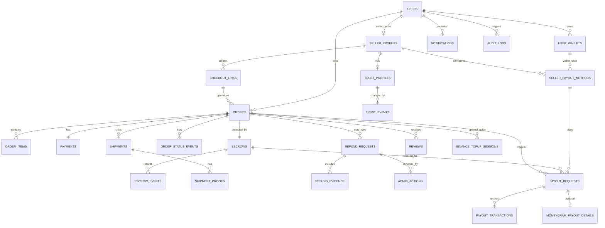

# Trustip ERD Specification v1.1

**Product:** Trustip - Stellar-Native Protected Checkout with Multi-Route Seller Payout  
**Version:** v1.1  
**Status:** Revised ERD after MoneyGram seller payout scope update  
**Latest Scope:** Buyer pays USDC via Stellar Wallet (Freighter + xBull), Binance is a top-up guide, seller payout supports USDC wallet, XLM route, and MoneyGram cash-out/off-ramp route.

## 1. Document Purpose

This document defines the backend data model and ERD for Trustip v1.1.

Trustip is a protected checkout app for social commerce. Buyer pays with USDC through a Stellar wallet. Funds are locked in a Soroban escrow contract until the order is completed, released to the seller payout route, or refunded to the buyer.

The v1.1 update adds multi-route seller payout. MoneyGram is not used as the primary buyer checkout rail. MoneyGram is used as part of seller payout and off-ramp strategy.

## 2. Scope Lock

Buyer payment MVP: Wallet Stellar Native using Freighter and xBull, with USDC on Stellar.

Buyer top-up helper: Binance guided top-up, where buyer obtains USDC externally and then pays with a Stellar wallet.

Seller payout MVP/roadmap model: USDC wallet payout as primary, XLM payout as stretch, and MoneyGram cash-out/off-ramp as seller payout route.

Out of buyer MVP: QRIS, local bank transfer, automatic Rupiah-to-USDC conversion, and MoneyGram as primary buyer payment.

## 3. System Boundary

Database handles application state: accounts, seller profiles, checkout links, orders, shipment evidence, refund evidence, payout preferences, payout requests, and Trust Profile metrics.

Stellar/Soroban handles value protection: USDC payment authorization, escrow lock, release, refund, and transaction proof.

External providers such as Binance and MoneyGram are treated as top-up/off-ramp routes, not as the source of truth for escrow state.

Database state must follow verified on-chain state. The database must not claim payment, release, or refund success before the related transaction or provider state is verified.

## 4. High-Level ERD



## 5. Core Entities

### 5.1 users

| Field         |        Type | Notes                                        |
| ------------- | ----------: | -------------------------------------------- |
| id            |        uuid | Primary key                                  |
| email         |        text | Unique, nullable if wallet-only signup later |
| phone         |        text | Optional for seller verification             |
| display_name  |        text | Public display name                          |
| role          |        enum | buyer, seller, admin                         |
| auth_provider |        enum | email, google, wallet                        |
| status        |        enum | active, suspended, pending_review            |
| created_at    | timestamptz | Created timestamp                            |
| updated_at    | timestamptz | Updated timestamp                            |

### 5.2 user_wallets

| Field           |        Type | Notes                                            |
| --------------- | ----------: | ------------------------------------------------ |
| id              |        uuid | Primary key                                      |
| user_id         |        uuid | FK to users.id                                   |
| wallet_provider |        enum | freighter, xbull, other                          |
| public_key      |        text | Stellar G-address                                |
| network         |        enum | testnet, mainnet                                 |
| is_primary      |     boolean | Default wallet for payment/payout                |
| verified_at     | timestamptz | Set after signed challenge or successful connect |
| created_at      | timestamptz | Created timestamp                                |

### 5.3 seller_profiles

| Field                    |        Type | Notes                                             |
| ------------------------ | ----------: | ------------------------------------------------- |
| id                       |        uuid | Primary key                                       |
| user_id                  |        uuid | FK to users.id                                    |
| store_name               |        text | Seller/store name                                 |
| category                 |        text | Jastip, preorder, merch, group buy, etc.          |
| social_url               |        text | Instagram/TikTok/WhatsApp link                    |
| product_type             |        text | Seller product type                               |
| phone_verified           |     boolean | Seller activation checklist                       |
| email_verified           |     boolean | Seller activation checklist                       |
| identity_status          |        enum | not_started, pending, verified, rejected          |
| kyc_status               |        enum | not_required_mvp, pending_future, verified_future |
| default_payout_method_id |        uuid | FK to seller_payout_methods.id, nullable          |
| activation_status        |        enum | incomplete, ready, restricted                     |
| created_at               | timestamptz | Created timestamp                                 |

### 5.4 checkout_links

| Field               |          Type | Notes                            |
| ------------------- | ------------: | -------------------------------- |
| id                  |          uuid | Primary key                      |
| seller_profile_id   |          uuid | FK to seller_profiles.id         |
| slug                |          text | Unique public link slug          |
| title               |          text | Product/order title              |
| description         |          text | Product details                  |
| price_usdc          | numeric(20,7) | Final payable USDC amount        |
| price_idr_reference | numeric(20,2) | Display/reference only           |
| currency_display    |          text | Usually IDR reference            |
| status              |          enum | draft, active, inactive, expired |
| expires_at          |   timestamptz | Optional link expiry             |
| created_at          |   timestamptz | Created timestamp                |

### 5.5 orders

| Field                     |          Type | Notes                                                          |
| ------------------------- | ------------: | -------------------------------------------------------------- |
| id                        |          uuid | Primary key                                                    |
| order_no                  |          text | Human-friendly unique order code                               |
| checkout_link_id          |          uuid | FK to checkout_links.id                                        |
| buyer_user_id             |          uuid | FK to users.id, nullable for guest pre-auth                    |
| seller_profile_id         |          uuid | FK to seller_profiles.id                                       |
| status                    |          enum | See order_status enum                                          |
| total_usdc                | numeric(20,7) | Final USDC amount                                              |
| total_idr_reference       | numeric(20,2) | Display/reference only                                         |
| buyer_wallet_id           |          uuid | FK to user_wallets.id after connect                            |
| seller_wallet_id          |          uuid | FK to user_wallets.id for direct wallet payout                 |
| selected_payout_method_id |          uuid | FK to seller_payout_methods.id, nullable until route selection |
| created_at                |   timestamptz | Created timestamp                                              |
| paid_at                   |   timestamptz | Set after payment verification                                 |
| completed_at              |   timestamptz | Set after completion/release                                   |
| cancelled_at              |   timestamptz | Set if cancelled                                               |

### 5.6 order_items

| Field           |          Type | Notes                 |
| --------------- | ------------: | --------------------- |
| id              |          uuid | Primary key           |
| order_id        |          uuid | FK to orders.id       |
| name            |          text | Item name             |
| quantity        |       integer | Quantity              |
| unit_price_usdc | numeric(20,7) | Unit price            |
| subtotal_usdc   | numeric(20,7) | quantity x unit price |
| metadata        |         jsonb | Size, variant, notes  |

### 5.7 payments

| Field            |          Type | Notes                                                                        |
| ---------------- | ------------: | ---------------------------------------------------------------------------- |
| id               |          uuid | Primary key                                                                  |
| order_id         |          uuid | FK to orders.id                                                              |
| method           |          enum | stellar_wallet, binance_pay_future                                           |
| status           |          enum | pending, awaiting_signature, submitted, confirmed, failed, expired, refunded |
| asset_code       |          text | USDC                                                                         |
| asset_issuer     |          text | Circle issuer address per network                                            |
| network          |          enum | testnet, mainnet                                                             |
| amount_usdc      | numeric(20,7) | Amount paid                                                                  |
| payer_public_key |          text | Buyer wallet public key                                                      |
| tx_hash          |          text | Stellar/Soroban transaction hash                                             |
| ledger           |        bigint | Optional ledger number                                                       |
| failure_reason   |          text | Error display/debug                                                          |
| created_at       |   timestamptz | Created timestamp                                                            |
| confirmed_at     |   timestamptz | Confirmed timestamp                                                          |

### 5.8 escrows

| Field                    |          Type | Notes                                                                         |
| ------------------------ | ------------: | ----------------------------------------------------------------------------- |
| id                       |          uuid | Primary key                                                                   |
| order_id                 |          uuid | FK to orders.id                                                               |
| contract_id              |          text | Soroban escrow contract ID                                                    |
| contract_order_id        |          text | Order ID used in contract                                                     |
| status                   |          enum | not_created, created, funded, released, refunded, cancelled, paused           |
| asset_code               |          text | USDC                                                                          |
| amount_usdc              | numeric(20,7) | Escrow amount                                                                 |
| buyer_public_key         |          text | Buyer address                                                                 |
| seller_public_key        |          text | Seller direct payout address, nullable for treasury-orchestrated future route |
| release_destination_type |          enum | seller_wallet, payout_treasury_future                                         |
| funded_tx_hash           |          text | Funding tx hash                                                               |
| release_tx_hash          |          text | Release tx hash                                                               |
| refund_tx_hash           |          text | Refund tx hash                                                                |
| created_at               |   timestamptz | Created timestamp                                                             |
| funded_at                |   timestamptz | Set after lock/funding                                                        |
| released_at              |   timestamptz | Set after seller/payout release                                               |
| refunded_at              |   timestamptz | Set after buyer refund                                                        |

### 5.9 escrow_events

| Field           |          Type | Notes                                              |
| --------------- | ------------: | -------------------------------------------------- |
| id              |          uuid | Primary key                                        |
| escrow_id       |          uuid | FK to escrows.id                                   |
| event_type      |          enum | create, fund, lock, release, refund, cancel, error |
| tx_hash         |          text | Unique when available                              |
| ledger          |        bigint | Ledger number                                      |
| from_public_key |          text | Sender                                             |
| to_public_key   |          text | Receiver/contract                                  |
| amount_usdc     | numeric(20,7) | Event amount                                       |
| raw_event       |         jsonb | Contract event/RPC response                        |
| created_at      |   timestamptz | Created timestamp                                  |

### 5.10 seller_payout_methods

| Field             |        Type | Notes                                                       |
| ----------------- | ----------: | ----------------------------------------------------------- |
| id                |        uuid | Primary key                                                 |
| seller_profile_id |        uuid | FK to seller_profiles.id                                    |
| method_type       |        enum | usdc_wallet, xlm_wallet, moneygram_cashout                  | Note: API constants (USDC_WALLET, XLM_WALLET, MONEYGRAM_CASHOUT) map to these lowercase DB values |
| display_name      |        text | Seller-facing label, e.g. USDC Wallet or MoneyGram Cash-Out |
| is_default        |     boolean | Default route for completed orders                          |
| status            |        enum | active, disabled, needs_review, unsupported_region          |
| wallet_id         |        uuid | FK to user_wallets.id, used for wallet payout routes        |
| stellar_address   |        text | Destination Stellar address for wallet routes               |
| asset_code        |        text | USDC or XLM when wallet route                               |
| cashout_country   |        text | MoneyGram/off-ramp country, nullable                        |
| cashout_currency  |        text | Fiat cash-out currency, nullable                            |
| external_provider |        text | moneygram for MoneyGram route                               |
| provider_payload  |       jsonb | Encrypted/minimized provider setup metadata                 |
| created_at        | timestamptz | Created timestamp                                           |
| updated_at        | timestamptz | Updated timestamp                                           |

### 5.11 payout_requests

| Field                  |          Type | Notes                                                                                                  |
| ---------------------- | ------------: | ------------------------------------------------------------------------------------------------------ |
| id                     |          uuid | Primary key                                                                                            |
| order_id               |          uuid | FK to orders.id                                                                                        |
| escrow_id              |          uuid | FK to escrows.id                                                                                       |
| seller_profile_id      |          uuid | FK to seller_profiles.id                                                                               |
| payout_method_id       |          uuid | FK to seller_payout_methods.id                                                                         |
| route_type             |          enum | usdc_wallet, xlm_wallet, moneygram_cashout                                                             |
| status                 |          enum | not_requested, route_selected, pending_release, processing, completed, failed, needs_review, cancelled |
| amount_usdc            | numeric(20,7) | Amount released from escrow before fees/conversion                                                     |
| target_asset_code      |          text | USDC, XLM, or fiat currency for display                                                                |
| target_amount_estimate | numeric(20,7) | Estimated received amount if converted/off-ramped                                                      |
| fee_estimate_usdc      | numeric(20,7) | Fee estimate when applicable                                                                           |
| rate_snapshot          |         jsonb | Conversion/route quote snapshot when applicable                                                        |
| release_mode           |          enum | direct_wallet, guided_offramp, treasury_orchestrated_future                                            |
| provider_reference_id  |          text | External reference, if any                                                                             |
| failure_reason         |          text | Error detail                                                                                           |
| requested_at           |   timestamptz | Route selected/requested timestamp                                                                     |
| processed_at           |   timestamptz | Processing timestamp                                                                                   |
| completed_at           |   timestamptz | Completed timestamp                                                                                    |

### 5.12 payout_transactions

| Field                 |          Type | Notes                                                                                                                         |
| --------------------- | ------------: | ----------------------------------------------------------------------------------------------------------------------------- |
| id                    |          uuid | Primary key                                                                                                                   |
| payout_request_id     |          uuid | FK to payout_requests.id                                                                                                      |
| transaction_type      |          enum | escrow_release, stellar_payment, path_payment, moneygram_cashout_created, moneygram_cashout_completed, reconciliation, failed |
| network               |          enum | testnet, mainnet, external                                                                                                    |
| asset_code            |          text | USDC, XLM, or fiat display                                                                                                    |
| amount                | numeric(20,7) | Transaction amount                                                                                                            |
| tx_hash               |          text | Stellar tx hash when applicable                                                                                               |
| external_reference_id |          text | MoneyGram/provider reference when applicable                                                                                  |
| status                |          enum | submitted, confirmed, failed, pending_external                                                                                |
| raw_payload           |         jsonb | RPC/provider response                                                                                                         |
| created_at            |   timestamptz | Created timestamp                                                                                                             |

### 5.13 moneygram_payout_details

| Field                  |        Type | Notes                                                                                           |
| ---------------------- | ----------: | ----------------------------------------------------------------------------------------------- |
| id                     |        uuid | Primary key                                                                                     |
| payout_request_id      |        uuid | FK to payout_requests.id, unique                                                                |
| integration_level      |        enum | guided, integrated_future                                                                       |
| country                |        text | Cash-out/off-ramp country                                                                       |
| cashout_currency       |        text | Currency seller expects to receive                                                              |
| moneygram_reference_id |        text | External ref for integrated future route                                                        |
| external_status        |        enum | not_started, guide_opened, initiated, pending_kyc, ready_for_pickup, completed, failed, expired |
| recipient_profile_ref  |        text | Encrypted reference only; avoid storing raw sensitive PII                                       |
| location_hint          |        text | Optional location/agent hint                                                                    |
| compliance_status      |        enum | not_required_mvp, pending, approved, rejected                                                   |
| metadata               |       jsonb | Provider route data; encrypt sensitive values                                                   |
| created_at             | timestamptz | Created timestamp                                                                               |
| updated_at             | timestamptz | Updated timestamp                                                                               |

### 5.14 order_status_events

| Field         |        Type | Notes                           |
| ------------- | ----------: | ------------------------------- |
| id            |        uuid | Primary key                     |
| order_id      |        uuid | FK to orders.id                 |
| status        |        enum | Order status snapshot           |
| label_public  |        text | Buyer-friendly label            |
| actor_user_id |        uuid | User/admin/system who triggered |
| actor_type    |        enum | buyer, seller, admin, system    |
| metadata      |       jsonb | Optional details                |
| created_at    | timestamptz | Created timestamp               |

### 5.15 shipments

| Field           |        Type | Notes                                  |
| --------------- | ----------: | -------------------------------------- |
| id              |        uuid | Primary key                            |
| order_id        |        uuid | FK to orders.id                        |
| courier_name    |        text | Courier/logistics provider             |
| tracking_number |        text | Resi                                   |
| status          |        enum | processing, packed, shipped, delivered |
| shipped_at      | timestamptz | Shipment timestamp                     |
| delivered_at    | timestamptz | Delivery timestamp                     |
| seller_note     |        text | Seller note                            |
| created_at      | timestamptz | Created timestamp                      |

### 5.16 shipment_proofs

| Field       |        Type | Notes                                         |
| ----------- | ----------: | --------------------------------------------- |
| id          |        uuid | Primary key                                   |
| shipment_id |        uuid | FK to shipments.id                            |
| uploaded_by |        uuid | FK to users.id                                |
| file_url    |        text | Supabase Storage path or signed URL reference |
| file_type   |        enum | photo, video, document                        |
| proof_type  |        enum | packing_photo, shipping_receipt, item_photo   |
| created_at  | timestamptz | Created timestamp                             |

### 5.17 refund_requests

| Field                 |          Type | Notes                                                                          |
| --------------------- | ------------: | ------------------------------------------------------------------------------ |
| id                    |          uuid | Primary key                                                                    |
| order_id              |          uuid | FK to orders.id                                                                |
| buyer_user_id         |          uuid | FK to users.id                                                                 |
| seller_profile_id     |          uuid | FK to seller_profiles.id                                                       |
| reason_code           |          enum | not_received, wrong_item, damaged, fake, seller_unresponsive, other            |
| description           |          text | Buyer explanation                                                              |
| status                |          enum | submitted, under_review, seller_response_needed, approved, rejected, completed |
| requested_amount_usdc | numeric(20,7) | Refund requested                                                               |
| decision              |          enum | none, refund_buyer, release_seller, partial_refund_future                      |
| decision_note         |          text | Admin explanation                                                              |
| created_at            |   timestamptz | Created timestamp                                                              |
| resolved_at           |   timestamptz | Resolution timestamp                                                           |

### 5.18 refund_evidence

| Field             |        Type | Notes                                                                |
| ----------------- | ----------: | -------------------------------------------------------------------- |
| id                |        uuid | Primary key                                                          |
| refund_request_id |        uuid | FK to refund_requests.id                                             |
| uploaded_by       |        uuid | FK to users.id                                                       |
| actor_type        |        enum | buyer, seller, admin                                                 |
| file_url          |        text | Storage path                                                         |
| file_type         |        enum | photo, video, document                                               |
| evidence_type     |        enum | unboxing_video, chat_screenshot, shipping_receipt, item_photo, other |
| note              |        text | Optional note                                                        |
| created_at        | timestamptz | Created timestamp                                                    |

### 5.19 reviews

| Field             |        Type | Notes                    |
| ----------------- | ----------: | ------------------------ |
| id                |        uuid | Primary key              |
| order_id          |        uuid | FK to orders.id          |
| buyer_user_id     |        uuid | FK to users.id           |
| seller_profile_id |        uuid | FK to seller_profiles.id |
| rating            |     integer | 1-5                      |
| comment           |        text | Optional review text     |
| created_at        | timestamptz | Created timestamp        |

### 5.20 binance_topup_sessions

| Field                     |          Type | Notes                                                      |
| ------------------------- | ------------: | ---------------------------------------------------------- |
| id                        |          uuid | Primary key                                                |
| order_id                  |          uuid | FK to orders.id                                            |
| buyer_user_id             |          uuid | FK to users.id                                             |
| amount_usdc               | numeric(20,7) | Amount buyer needs                                         |
| guide_status              |          enum | opened, copied_address, completed_self_reported, abandoned |
| wallet_address_to_receive |          text | Buyer Stellar wallet address, if known                     |
| created_at                |   timestamptz | Created timestamp                                          |

### 5.21 admin_actions

| Field             |        Type | Notes                                                                                                             |
| ----------------- | ----------: | ----------------------------------------------------------------------------------------------------------------- |
| id                |        uuid | Primary key                                                                                                       |
| admin_user_id     |        uuid | FK to users.id                                                                                                    |
| order_id          |        uuid | FK to orders.id                                                                                                   |
| refund_request_id |        uuid | FK to refund_requests.id, nullable                                                                                |
| payout_request_id |        uuid | FK to payout_requests.id, nullable                                                                                |
| action_type       |        enum | approve_refund, reject_refund, force_release, restrict_seller, mark_payout_review, approve_payout_retry, add_note |
| note              |        text | Admin reasoning                                                                                                   |
| metadata          |       jsonb | Before/after data                                                                                                 |
| created_at        | timestamptz | Created timestamp                                                                                                 |

### 5.22 notifications

| Field      |        Type | Notes                                                   |
| ---------- | ----------: | ------------------------------------------------------- |
| id         |        uuid | Primary key                                             |
| user_id    |        uuid | FK to users.id                                          |
| type       |        text | Notification type (e.g. payment, order, refund, payout) |
| title      |        text | Notification title                                      |
| message    |        text | Notification body                                       |
| read_at    | timestamptz | Nullable, set when read                                 |
| created_at | timestamptz | Created timestamp                                       |

### 5.23 audit_logs

| Field         |        Type | Notes                                       |
| ------------- | ----------: | ------------------------------------------- |
| id            |        uuid | Primary key                                 |
| actor_user_id |        uuid | FK to users.id, nullable for system actions |
| actor_role    |        enum | buyer, seller, admin, system                |
| action        |        text | Action name                                 |
| entity_type   |        text | Affected entity type, e.g. orders, refunds  |
| entity_id     |        uuid | Affected entity ID                          |
| metadata      |       jsonb | Additional context payload                  |
| created_at    | timestamptz | Created timestamp                           |

## 6. Recommended Enums

```sql
-- User and wallet
user_role = buyer | seller | admin
user_status = active | suspended | pending_review
wallet_provider = freighter | xbull | other
network = testnet | mainnet

-- Order
order_status = awaiting_payment | payment_submitted | payment_confirmed | escrow_locked | processing | packed | shipped | delivered | completed | payout_pending | payout_completed | refund_requested | refund_review | refunded | cancelled | failed

-- Payment
payment_method = stellar_wallet | binance_pay_future
payment_status = pending | awaiting_signature | submitted | confirmed | failed | expired | refunded

-- Escrow
escrow_status = not_created | created | funded | released | refunded | cancelled | paused
escrow_event_type = create | fund | lock | release | refund | cancel | error
release_destination_type = seller_wallet | payout_treasury_future

-- Payout
payout_method_type = usdc_wallet | xlm_wallet | moneygram_cashout  -- Note: API constants (USDC_WALLET, XLM_WALLET, MONEYGRAM_CASHOUT) map to lowercase
payout_method_status = active | disabled | needs_review | unsupported_region
payout_status = not_requested | route_selected | pending_release | processing | completed | failed | needs_review | cancelled
payout_release_mode = direct_wallet | guided_offramp | treasury_orchestrated_future
payout_transaction_type = escrow_release | stellar_payment | path_payment | moneygram_cashout_created | moneygram_cashout_completed | reconciliation | failed
moneygram_integration_level = guided | integrated_future
moneygram_status = not_started | guide_opened | initiated | pending_kyc | ready_for_pickup | completed | failed | expired

-- Refund
refund_status = submitted | under_review | seller_response_needed | approved | rejected | completed
refund_reason_code = not_received | wrong_item | damaged | fake | seller_unresponsive | other
```

## 7. Payout Route Modeling

| Route                | Database method_type | Release mode                                  | MVP meaning                                                                                                  |
| -------------------- | -------------------- | --------------------------------------------- | ------------------------------------------------------------------------------------------------------------ |
| USDC wallet          | usdc_wallet          | direct_wallet                                 | Soroban releases USDC to seller Stellar wallet.                                                              |
| XLM wallet           | xlm_wallet           | direct_wallet or treasury_orchestrated_future | Stretch route. USDC may be routed/swapped to XLM before seller receives it.                                  |
| MoneyGram cash-out   | moneygram_cashout    | guided_offramp                                | MVP-compatible guide: seller receives USDC, then follows MoneyGram-supported cash-out/off-ramp instructions. |
| MoneyGram integrated | moneygram_cashout    | treasury_orchestrated_future                  | Production route requiring MoneyGram/partner API, compliance, KYC/KYB, and reconciliation.                   |

## 8. Buyer-Friendly Status Mapping

| Internal Status   | Buyer Label             |
| ----------------- | ----------------------- |
| awaiting_payment  | Menunggu Pembayaran     |
| payment_submitted | Pembayaran Diproses     |
| escrow_locked     | Pesanan Aman            |
| processing        | Pesanan Diproses        |
| packed            | Sedang Dikemas          |
| shipped           | Dalam Pengiriman        |
| delivered         | Barang Sampai           |
| completed         | Pesanan Selesai         |
| payout_pending    | Dana Seller Diproses    |
| payout_completed  | Dana Seller Diterima    |
| refund_requested  | Bantuan Diajukan        |
| refund_review     | Bantuan Sedang Ditinjau |
| refunded          | Refund Selesai          |

## 9. Data Integrity Rules

1. One order can have only one active escrow.
2. Payment cannot be marked confirmed without verified transaction hash or contract event.
3. Escrow cannot be released before escrow status is locked.
4. Escrow cannot be refunded after release.
5. Escrow cannot be released after refund.
6. Seller cannot update shipment before payment is confirmed and escrow is locked.
7. Buyer can submit review only after order is completed.
8. Buyer can request refund only after escrow is locked and before order completion.
9. Each seller can have multiple payout methods, but only one default active payout method per seller.
10. Payout request cannot be completed unless escrow release is confirmed or external provider completion is verified.
11. MoneyGram integrated payout must store only minimized/encrypted provider data; raw sensitive PII should not be stored unless required and protected.
12. Admin actions must be logged and never deleted.
13. Evidence files must be stored in private buckets and served through signed URLs.

## 10. Indexing Recommendations

| Table                    | Index                                                                |
| ------------------------ | -------------------------------------------------------------------- |
| users                    | email, role, status                                                  |
| user_wallets             | user_id, public_key, network                                         |
| checkout_links           | slug, seller_profile_id, status                                      |
| orders                   | order_no, buyer_user_id, seller_profile_id, status, created_at       |
| payments                 | order_id, tx_hash, status                                            |
| escrows                  | order_id, contract_order_id, status, funded_tx_hash, release_tx_hash |
| seller_payout_methods    | seller_profile_id, method_type, status, is_default                   |
| payout_requests          | order_id, seller_profile_id, payout_method_id, route_type, status    |
| payout_transactions      | payout_request_id, tx_hash, external_reference_id, status            |
| moneygram_payout_details | payout_request_id, moneygram_reference_id, external_status           |
| shipments                | order_id, tracking_number                                            |
| refund_requests          | order_id, status, seller_profile_id                                  |
| trust_events             | trust_profile_id, order_id, event_type                               |
| audit_logs               | user_id, created_at, action_type                                     |

## 11. Row-Level Security and Permissions

### 11.1 Buyer

Buyer can read own orders, connect own wallets, read own payment/escrow status, create eligible refund requests, upload refund evidence, and submit reviews after completion. Buyer cannot edit seller shipment, alter escrow state, approve own refund, or modify payout data.

### 11.2 Seller

Seller can create checkout links, read orders linked to their seller profile, update shipment status after escrow is locked, upload shipment proof, respond to refund requests, configure own payout methods, view own payout history, and request/choose payout route where allowed. Seller cannot alter payment tx hash, directly modify escrow state, delete evidence, or mark MoneyGram/integrated payout completed without provider/admin/system verification.

### 11.3 Admin/System

Admin/system can reconcile on-chain status, review refund evidence, approve refund/release actions, mark payout as needs review, retry or reconcile failed payout, restrict seller account, and write audit/admin action records.

## 12. Final ERD Recommendation

Use Supabase Postgres as the application database. Keep order, shipment, evidence, review, payout preference, payout request, and Trust Profile data in Postgres. Keep payment protection in Soroban and store only verified transaction hashes, contract IDs, provider references, and cached state in the database. For v1.1, do not model MoneyGram as a buyer payment rail. Model MoneyGram as seller payout/off-ramp route.
